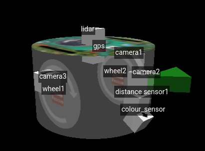

# Robotik2627

Repository for participation at the Robocup 2027 in the category Rescue Simulation

## Team

Our team consists of three members: Bastian, Jonas and Luis. We develop this project as a part of our participation in the robotics club at our school in Rahden.

## Competition

The participants programm a virtual robot, the e-puck. The robot has to drive through an maze, create a map and recognise victims and dangers with the cams.\
Website: https://rescuesim.robocup.org/ \
Rules: https://junior.robocup.org/wp-content/uploads/2026/02/RCJRescueSimulation2026-final.pdf

## Features

### Robot
\
Sensors: Lidar, GPS, ultrasonic sensor, cams, inertial unit, wheel rotation sensors

### Sensor Evalutation

### Mapping

We create the map with a two-dimensial numpy-Array. Each element represents a quarter of a 12 cm field, as in the rules written.
On one hand mapping is a opportunity to multiply our score, on the other hand we can also use this data for path finding.

### Driving